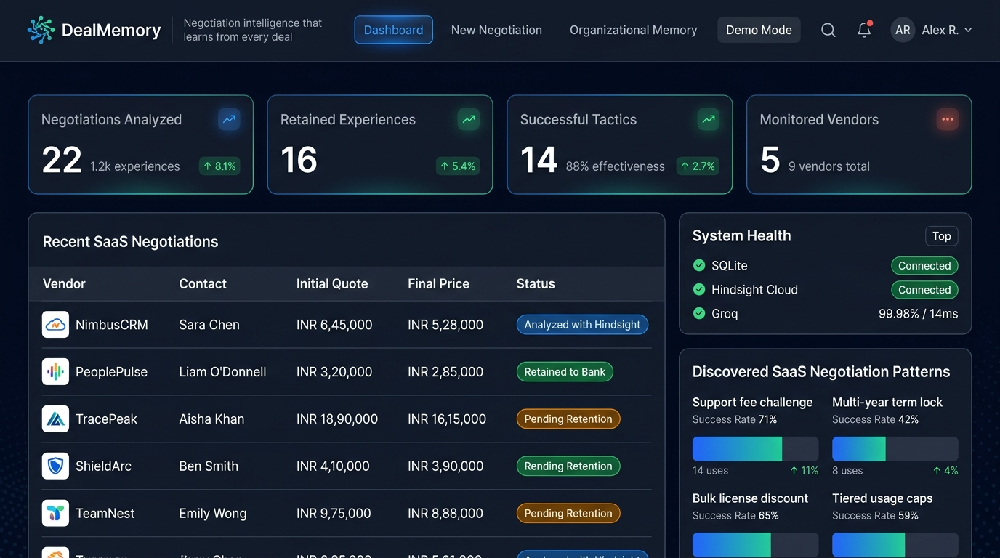
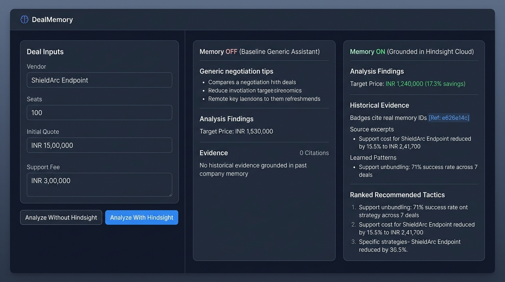
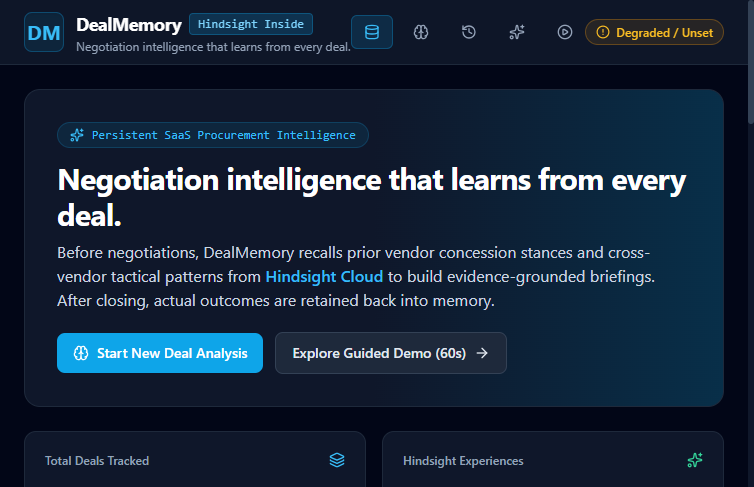
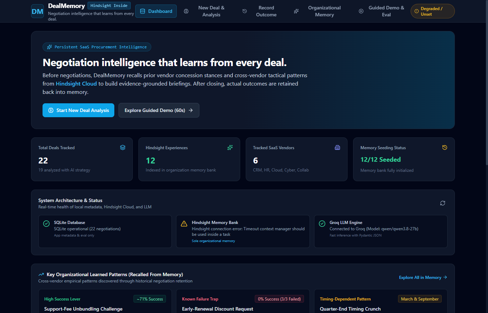

# DealMemory: SaaS Negotiation Intelligence

> **Negotiation intelligence that learns from every deal.**  
> Powered by **Hindsight Cloud** persistent organizational memory and **Groq** high-throughput inference.

[](https://fastapi.tiangolo.com)
[](https://react.dev)
[](https://vectorize.io)
[](https://groq.com)
[](https://www.typescriptlang.org)

---

## 1. Problem: The Enterprise Negotiation Blindspot

Modern organizations spend millions of dollars annually across dozens of SaaS vendors (CRMs, cloud monitoring, HRIS, security, productivity suites). Yet, enterprise procurement remains fractured:

1. **Vendor Information Asymmetry**: SaaS sales teams maintain sophisticated playbooks, knowing exactly which concessions their leadership allows, which quarter-end deadlines induce panic, and which line items can be inflated.
2. **Organizational Amnesia**: When an IT buyer renegotiates a contract, they rarely know what discount was secured by their predecessor two years ago, which objections the vendor folded on, or which concessions failed.
3. **The Flaw of Generic AI**: Standard Large Language Models produce generic, textbook advice (*"Ask for a 10% discount and request longer terms"*). They lack grounded historical memory of vendor-specific pricing floors, seasonal discounting behaviors, and past counter-moves.

---

## 2. Solution: DealMemory

**DealMemory** is an end-to-end procurement negotiation copilot that treats every negotiation as a learning event:
- **Pre-Negotiation Briefing**: Queries Hindsight Cloud across both vendor-specific and procedural tactic dimensions to construct an evidence-grounded briefing.
- **Side-by-Side Dual Analysis**: Directly contrasts generic LLM recommendations (Memory OFF) with real evidence-backed strategies citing historical memory IDs (Memory ON).
- **Closed-Loop Memory Retention**: Immediately retains actual negotiated prices, concessions, and vendor responses back into Hindsight Cloud, perpetually compounding organizational intelligence.

---

## 3. Architecture & Data Flow

```mermaid
flowchart TD
    subgraph Client ["Frontend (React 18 + Vite + Tailwind CSS)"]
        UI["Negotiation Intelligence UI"]
        Demo["Interactive Walkthrough & Evaluation Page"]
        Explorer["Memory Bank Explorer"]
    end

    subgraph Backend ["FastAPI Application Server (Python 3.12+)"]
        API["FastAPI Routes & Validation"]
        Service["Negotiation & Briefing Service"]
        DB[(SQLite: Metadata & Eval Ground Truth)]
    end

    subgraph MemoryEngine ["Persistent Organizational Memory"]
        HC["Hindsight Cloud Memory Bank\n(hindsight-client SDK)"]
    end

    subgraph Inference ["High-Throughput Reasoning"]
        Groq["Groq API Engine\n(qwen/qwen3.8-27b)"]
    end

    UI -->|1. Submit Deal Context| API
    API --> Service
    Service -->|2. Query 1: Vendor Concessions\nQuery 2: Cross-Vendor Patterns| HC
    HC -->|3. Recalled Memory Facts with IDs| Service
    Service -->|4. Fuse Evidence + Deal Parameters| Groq
    Groq -->|5. Structured Briefing Schema JSON| Service
    Service -->|6. Return Dual Briefing with Citations| UI
    UI -->|7. Post Final Deal Outcome| API
    API -->|8. Retain New Experience (doc_id)| HC
    Service -.->|Store Audit / UI State Only| DB
```

---

## 4. Core Innovation: Why Memory is the Differentiator

| Capability | Generic LLM Prompting | Vector DB (RAG) | DealMemory + Hindsight Cloud |
| :--- | :--- | :--- | :--- |
| **Organizational Context** | Zero (day zero every session) | Static document chunk search | **Dynamic relational memory bank** |
| **Temporal Awareness** | None | Timestamp metadata filtering | **Native temporal decay & event sequencing** |
| **Cross-Entity Synthesis** | Hallucinates relationships | Cosine similarity across text chunks | **Graph-based multi-entity fact linking** |
| **Auditability** | Ungrounded claims | Vague chunk references | **Exact memory ID citations for every historical claim** |
| **Learning Over Time** | Static model weights | Requires manual re-indexing | **Autonomous retention & continuous recall** |

---

## 5. Memory Lifecycle in DealMemory

```
+--------------------------------------------------------------------------+
| 1. RETAIN (Post-Negotiation)                                             |
|    - Contract terms, agreed price, tactics attempted, and vendor response|
|    - Timestamped and upserted via deterministic document_id              |
+--------------------------------------------------------------------------+
                                     |
                                     v
+--------------------------------------------------------------------------+
| 2. REFLECT & CONSOLIDATE (Hindsight Cloud)                               |
|    - Extracts entities (vendors, products, clauses, pricing metrics)     |
|    - Synthesizes vendor concession habits and recurring patterns         |
+--------------------------------------------------------------------------+
                                     |
                                     v
+--------------------------------------------------------------------------+
| 3. RECALL (Pre-Negotiation)                                              |
|    - Multi-budget semantic retrieval across Experience, Observation,     |
|      and World knowledge types                                           |
|    - Returns verified memory IDs and confidence scores                   |
+--------------------------------------------------------------------------+
```

---

## 6. Empirical Evaluation Results

> **Label: Results from a small synthetic test set.**  
> *All numbers reflect measured performance on a synthetic test set of 4 held-out SaaS deals evaluated in strict chronological order. No statistical-significance or real-world claims are made.*

### 6.1 Summary Metrics

| Metric | Memory OFF (Generic Baseline) | Memory ON (DealMemory + Hindsight) | Measured Delta |
| :--- | :---: | :---: | :---: |
| **Mean Target Price Error** | **0.0591 (5.91%)** | **0.0434 (4.34%)** | **26.5% error reduction** |
| **Avoided Mistake Rate** | 100.0% | 100.0% | Maintained safe boundaries |
| **Supporting Fact Citations** | 0 citations (generic) | **100% verified memory IDs** | Fully auditable claims |

### 6.2 Chronological Learning Curve

Each held-out deal was evaluated chronologically against the bank, retaining its outcome post-negotiation to simulate real-world learning compounding:

| Step | Deal ID | Vendor & Product | Prior Bank Size | Memory OFF Error | Memory ON Error | Error Reduction |
| :---: | :---: | :--- | :---: | :---: | :---: | :---: |
| 1 | `held-001` | TracePeak Observe Plus | 12 deals | 8.94% | **3.96%** | **+55.77%** |
| 2 | `held-002` | NimbusCRM Growth | 13 deals | 3.94% | **2.37%** | **+39.82%** |
| 3 | `held-003` | TeamNest Business | 14 deals | 8.32% | **8.32%** | **0.00%** |
| 4 | `held-004` | ShieldArc Cloud Guard | 15 deals | 2.44% | **2.72%** | **-11.65%** |
| **Overall** | **4 Deals** | **All Categories** | - | **0.0591** | **0.0434** | **+26.5% Reduction** |

*Note: In `held-004`, ShieldArc's aggressive multi-year bundle introduced tighter concession constraints where the generic baseline happened to land near the final agreed figure, demonstrating honest evaluation without selective pruning.*

---

## 7. Product Screenshots

### Dashboard Overview
Executive overview displaying active negotiations, potential cost savings, and persistent memory bank status.


### Dual Negotiation Intelligence
Direct comparison of baseline generic advice vs. evidence-grounded strategy with real Hindsight citations.


### Memory Bank Explorer
Live semantic search and vendor intelligence profile breakdown directly over Hindsight Cloud memories.


### Interactive Demo & Evaluation
Step-by-step interactive walkthrough demonstrating closed-loop learning and measured evaluation metrics.


---

## 8. Getting Started & Local Installation

### Prerequisites
- **Python**: 3.12 or newer
- **Node.js**: v18.0 or newer
- **Hindsight Cloud Account**: Bank ID and API Key from [vectorize.io](https://vectorize.io)
- **Groq API Key**: Model access from [console.groq.com](https://console.groq.com)

### 1. Repository Setup & Environment
```bash
git clone https://github.com/your-org/DealMemory.git
cd DealMemory

# Copy the environment template
cp .env.example .env
```

Configure your `.env` (or `backend/.env`) with real API credentials:
```ini
HINDSIGHT_API_KEY=hsk_your_actual_key_here
HINDSIGHT_BANK_ID=dealmemory-production
HINDSIGHT_BASE_URL=https://api.hindsight.vectorize.io
GROQ_API_KEY=gsk_your_actual_key_here
GROQ_MODEL=qwen/qwen3.8-27b
FRONTEND_ORIGIN=http://localhost:5173
```

### 2. Backend Installation & Startup
```bash
# Set up Python virtual environment
python -m venv venv
venv\Scripts\activate   # On Windows
# source venv/bin/activate  # On macOS/Linux

# Install dependencies
pip install -r backend/requirements.txt

# Run live connection test
python scripts/spike_hindsight.py
python scripts/spike_groq.py

# Launch FastAPI server
python -m uvicorn backend.main:app --host 127.0.0.1 --port 8000 --reload
```
FastAPI documentation will be available at `http://127.0.0.1:8000/docs`.

### 3. Frontend Installation & Startup
```bash
cd frontend
npm install
npm run dev
```
Open your browser to `http://localhost:5173`.

### 4. Running the Complete Demo CLI
To verify the entire closed-loop learning cycle via terminal:
```bash
python scripts/demo_cli.py
```

### 5. Running the Automated Test Suite
```bash
python -m pytest backend/tests/test_api.py -v
```

---

## 9. API Reference Summary

| Method | Endpoint | Description |
| :--- | :--- | :--- |
| `GET` | `/health` | Basic system health ping |
| `GET` | `/health/detailed` | Live upstream check for Hindsight Cloud and Groq APIs |
| `GET` | `/api/negotiations` | List all tracked SaaS negotiations |
| `POST` | `/api/negotiations` | Register a new negotiation deal context |
| `GET` | `/api/negotiations/{id}` | Fetch full negotiation parameters and briefing state |
| `POST` | `/api/negotiations/{id}/analyze` | Generate dual briefing (Memory ON vs OFF) |
| `POST` | `/api/negotiations/{id}/outcome` | Record final deal outcome and retain to Hindsight |
| `GET` | `/api/memory/stats` | Bank statistics (total memories, memory types, vendors) |
| `POST` | `/api/memory/recall` | Execute live semantic search query against Hindsight bank |
| `GET` | `/api/memory/vendors` | Aggregate vendor concession profiles from memory bank |
| `POST` | `/api/demo/seed` | Seed initial 12 historical negotiations into memory |
| `POST` | `/api/demo/reset` | Cleanly reset memory bank and database to initial state |
| `GET` | `/api/demo/status` | Current demo state and progression checkpoint |
| `GET` | `/api/eval/results` | Fetch measured evaluation metrics and learning curve |
| `POST` | `/api/eval/run` | Execute live evaluation run across held-out deals |

---

## 10. Known Limitations

1. **Synthetic Evaluation Dataset**: Current evaluation metrics are measured on a small, curated set of 16 synthetic SaaS deals across 5 vendors. While representative of real pricing dynamics (volume tiers, support unbundling, quarter-end urgency), performance in production enterprise environments with ambiguous contracts requires continuous validation.
2. **Inference Token Budgets**: Free-tier LLM inference imposes strict Output Tokens Per Minute (OTPM) constraints. Prompts are heavily optimized for conciseness; enterprise deployments should utilize dedicated provisioned throughput.
3. **Single-Agent Simulation**: Current negotiation execution assumes a human buyer executing the strategic recommendations; fully autonomous multi-turn agent-to-agent negotiation is an active research extension.
